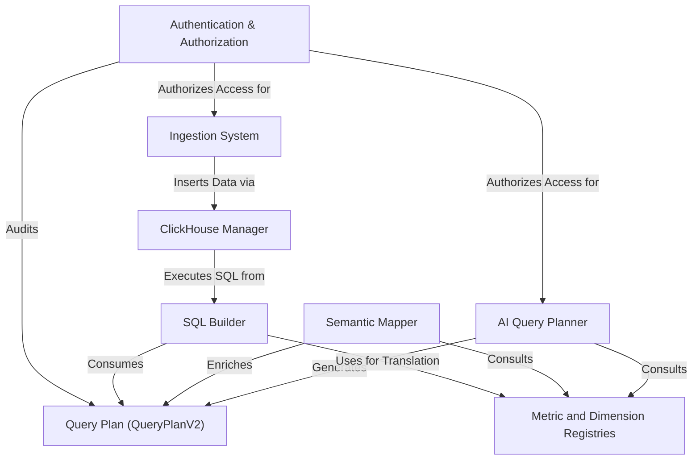

# SentientLog

The `Sentient-log` project is an **AI-powered observability platform** designed to help users understand their application logs by asking questions in *plain English*. It automatically translates these questions into detailed plans and then into **database queries** for fast analysis in a ClickHouse database, while also handling the *secure ingestion* of new log data and user authentication.

## Visual Overview

## Chapters

1. [Authentication & Authorization
](docs/01_authentication___authorization_.md)
2. [Metric and Dimension Registries
](docs/02_metric_and_dimension_registries_.md)
3. [AI Query Planner
](docs/03_ai_query_planner_.md)
4. [Query Plan (QueryPlanV2)
](docs/04_query_plan__queryplanv2__.md)
5. [Semantic Mapper
](docs/05_semantic_mapper_.md)
6. [SQL Builder
](docs/06_sql_builder_.md)
7. [ClickHouse Manager
](docs/07_clickhouse_manager_.md)
8. [Ingestion System
](docs/08_ingestion_system_.md)

---