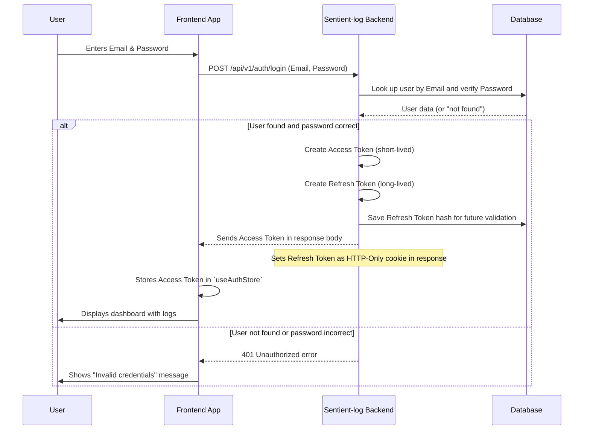

# Chapter 1: Authentication & Authorization

Imagine you have a super secret diary, full of your private thoughts and observations. You wouldn't want just anyone to pick it up and read it, right? You'd likely have a lock on it, and only you (or people you trust) would have the key.

In the world of computer systems, especially for something as sensitive as your observability data (which could contain critical information about your applications), we need a digital lock and key system. This is exactly what **Authentication & Authorization** provides for `Sentient-log`. It's the "security checkpoint" that protects all your valuable information.

### What Problem Does It Solve?

`Sentient-log` helps you understand what's happening inside your applications by collecting logs and metrics. This data can be very important – showing how your systems are performing, if there are any errors, or even details about your users' actions. You wouldn't want an unauthorized person to view, modify, or delete this data.

The core problem Authentication & Authorization solves is: **How do we make sure only the right people can access and interact with the `Sentient-log` system, and only in ways they are allowed to?**

Let's use a very common situation as our main example: **A user wants to log in to `Sentient-log` and then view their application logs.**

### Breaking Down the "Security Checkpoint"

The big phrase "Authentication & Authorization" can sound a bit intimidating, but it's just two main steps in our security checkpoint:

1.  **Authentication (Who are you?)**: This is like showing your ID at the entrance. It's about proving *who you are*.
    *   **Registration**: Creating a new user account (getting your ID for the first time).
    *   **Login**: Verifying your identity (showing your ID) using a password.
    *   **User Sessions**: Keeping track that you're still the same verified person while you use the system, so you don't have to show your ID every single time.
    *   **JWT Tokens**: These are like temporary, secure badges given to you after you log in, proving you're authenticated without revealing your password again.

2.  **Authorization (What are you allowed to do?)**: This is like the bouncer checking your VIP pass after you've shown your ID. It's about deciding *what you're allowed to do* based on who you are.
    *   For example, an "administrator" might be allowed to see all logs and manage users, while a "viewer" might only be able to see their own logs.

### How `Sentient-log` Uses It: Logging In

Let's walk through our use case: a user logging in and viewing their logs. From the user's perspective, they just type their email and password, click "Login," and then they see their data.

Behind the scenes, the `Sentient-log` frontend (what you see in your web browser) needs a way to remember that you're logged in. It uses a special "store" to hold your user information and your access token (that secure badge we talked about).

Here's a simplified look at how the frontend manages your authentication status:

```typescript
// frontend/src/store/authStore.ts
import { create } from "zustand";
import { persist, createJSONStorage } from "zustand/middleware";

// Define what a 'User' looks like
export interface User {
  id: string;
  email: string;
  role: string; // e.g., "viewer", "admin"
  is_active: boolean;
}

// Define the state for our authentication store
interface AuthState {
  user: User | null;
  accessToken: string | null;
  isAuthenticated: boolean;
  setAuth: (user: User, token: string) => void; // Function to log in
  clearAuth: () => void; // Function to log out
}

export const useAuthStore = create<AuthState>()(
  persist(
    (set) => ({
      user: null, // No user logged in initially
      accessToken: null,
      isAuthenticated: false, // Not authenticated initially
      setAuth: (user, token) =>
        set({ user, accessToken: token, isAuthenticated: true }), // Log in!
      clearAuth: () =>
        set({ user: null, accessToken: null, isAuthenticated: false }), // Log out!
    }),
    {
      name: "sentientlog-auth", // Name for local storage
      storage: createJSONStorage(() => localStorage),
      // Only these parts of the state will be saved
      partialize: (state) => ({
        user: state.user,
        accessToken: state.accessToken,
        isAuthenticated: state.isAuthenticated,
      }),
    },
  ),
);
```
This `useAuthStore` is like a small memory bank in your browser that remembers if you're logged in, who you are (`user`), and your `accessToken` (your temporary badge). When you successfully log in, `setAuth` is called to update this memory. When you log out, `clearAuth` clears it.

Now, whenever the frontend needs to talk to the `Sentient-log` backend (for example, to fetch your recent logs), it needs to show your "badge" (the `accessToken`). The `apiClient` automatically adds this badge to every request:

```typescript
// frontend/src/services/api.ts
import axios from "axios";
import { useAuthStore } from "../store/authStore"; // Import our auth store

export const apiClient = axios.create({
  baseURL: "", // Base URL for API requests
  headers: {
    "Content-Type": "application/json",
  },
  withCredentials: true, // Important for sending cookies (like refresh tokens)
});

// This part runs BEFORE every request is sent
apiClient.interceptors.request.use(
  (config) => {
    const accessToken = useAuthStore.getState().accessToken; // Get the badge
    if (accessToken) {
      config.headers.Authorization = `Bearer ${accessToken}`; // Attach the badge to the request
    }
    return config;
  },
  (error) => Promise.reject(error),
);

// ... (more code for handling responses and API functions)

export const api = {
  // ... (other API calls)

  login: async (credentials: any) => {
    // This calls the backend to actually log in
    const response = await apiClient.post("/api/v1/auth/login", credentials);
    return response.data;
  },

  logout: async () => {
    // This calls the backend to log out
    const response = await apiClient.post("/api/v1/auth/logout");
    return response.data;
  },

  getMe: async () => {
    // This calls the backend to get details about the current user
    const response = await apiClient.get("/api/v1/auth/me");
    return response.data;
  },
};
```
When you use `api.login(credentials)`, the frontend sends your email and password to the backend. If successful, the backend will send back an `accessToken`. The frontend then uses `useAuthStore.getState().setAuth()` to save this token and your user details. From then on, the `apiClient.interceptors.request.use` part automatically adds this `accessToken` to the header of all subsequent requests, so the backend knows you're authenticated!

### Under the Hood: How the Backend Handles Login

Let's peer behind the curtain and see what happens when you try to log in to the `Sentient-log` backend.



Here's a breakdown of the key parts in the backend:

1.  **Registering a New User**: When you sign up, the backend first checks if an account with that email already exists. If not, it creates a new user, hashes your password (meaning it scrambles it securely so even the system can't see your original password), and saves it to the database.

    ```python
    # app/auth/service.py
    from app.auth.models import User
    from app.auth.schemas import UserCreate
    from app.auth.hashing import hash_password # For securely scrambling passwords

    async def register_user(user_in: UserCreate) -> User:
        # Check if email is already taken
        existing_user = await User.find_one(User.email == user_in.email)
        if existing_user:
            raise HTTPException(status_code=400, detail="Email already registered")

        # Create a new user with a hashed password
        user = User(
            email=user_in.email,
            password_hash=hash_password(user_in.password), # Securely hash the password
            role="viewer" # New users start as 'viewer'
        )
        await user.insert() # Save the new user to the database
        return user
    ```
    This function (found in `app/auth/service.py`) handles the secure creation of your user account, making sure your password isn't stored in plain text. The `User` model, defined in `app/auth/models.py`, describes how user data (like email, password hash, role) is structured and stored in the database.

2.  **Authenticating (Logging In)**: When you try to log in, the backend finds your user based on the email. Then, it compares your provided password with the stored (hashed) password. If they match, you're authenticated!

    ```python
    # app/auth/service.py
    from app.auth.models import User
    from app.auth.schemas import LoginRequest
    from app.auth.hashing import verify_password # For checking passwords

    async def authenticate_user(login_in: LoginRequest) -> User:
        user = await User.find_one(User.email == login_in.email)
        # Check if user exists AND if the password is correct
        if not user or not verify_password(login_in.password, user.password_hash):
            raise HTTPException(status_code=401, detail="Incorrect email or password")
        
        # If active, update last login time and return user
        user.last_login = datetime.now(timezone.utc)
        await user.save()
        return user
    ```
    The `authenticate_user` function verifies your identity using your email and password.

3.  **Generating Tokens**: Once authenticated, the system creates two special tokens:
    *   **Access Token (JWT)**: This is your short-lived "badge" that the frontend uses for most requests. It's cryptographically signed to prevent tampering and contains basic info like your user ID and role.
    *   **Refresh Token**: This is a longer-lived token used to get a *new* access token when the old one expires, so you don't have to log in repeatedly. It's securely stored (as a hash) in the database (`app/auth/models.py` defines the `RefreshToken` model) and sent to the frontend as a secure `HTTP-Only` cookie, which means JavaScript in the browser can't directly access it, making it safer.

    ```python
    # app/auth/service.py
    from app.auth.models import User, RefreshToken
    from app.auth.jwt import create_access_token, create_refresh_token, decode_token

    async def generate_auth_tokens(user: User) -> Tuple[str, str]:
        # Create the short-lived access token
        access_payload = {
            "user_id": str(user.id),
            "email": user.email,
            "role": user.role
        }
        access_token = create_access_token(access_payload)

        # Create the long-lived refresh token
        refresh_token = create_refresh_token(str(user.id))
        
        # Hash the refresh token before storing it for security
        import hashlib
        token_hash = hashlib.sha256(refresh_token.encode()).hexdigest()
        
        # Decode to get expiration time
        decoded = decode_token(refresh_token)
        expires_at = datetime.fromtimestamp(decoded["exp"], tz=timezone.utc)
        
        # Store the hashed refresh token in the database
        rt_doc = RefreshToken(
            user_id=str(user.id),
            token_hash=token_hash,
            expires_at=expires_at
        )
        await rt_doc.insert()
        
        return access_token, refresh_token
    ```
    This `generate_auth_tokens` function creates your secure "badges" (tokens) after a successful login.

4.  **Handling Login/Logout Requests**: The `app/auth/routes.py` file defines the actual web addresses (endpoints) that the frontend calls for actions like `/register`, `/login`, `/refresh`, and `/logout`. These routes connect the web requests to the logic in `app/auth/service.py`.

    ```python
    # app/auth/routes.py
    from fastapi import APIRouter, Response
    from app.auth.schemas import UserCreate, LoginRequest, TokenResponse
    from app.auth.service import register_user, authenticate_user, generate_auth_tokens

    router = APIRouter(prefix="/auth", tags=["auth"])

    @router.post("/register", response_model=UserRead)
    async def register(user_in: UserCreate):
        user = await register_user(user_in) # Call the service function
        return UserRead(id=str(user.id), email=user.email, role=user.role, is_active=user.is_active)

    @router.post("/login", response_model=TokenResponse)
    async def login(login_in: LoginRequest, response: Response):
        user = await authenticate_user(login_in) # Verify user
        access_token, refresh_token = await generate_auth_tokens(user) # Create tokens
        
        # Set the refresh token as a secure cookie
        response.set_cookie(
            key="refresh_token",
            value=refresh_token,
            httponly=True, # JavaScript cannot access this cookie
            secure=False, # Should be True in production (HTTPS)
            samesite="lax",
            max_age=7 * 24 * 60 * 60 # Expires in 7 days
        )
        
        return TokenResponse(access_token=access_token) # Send access token to frontend
    ```
    The `login` route is where the `Sentient-log` backend sends the `access_token` to your browser and sets the `refresh_token` as a secure cookie.

### Authorization: What You Can Do

Once you're authenticated (logged in), the system then checks what you're *authorized* to do. `Sentient-log` uses roles (like "viewer" or "admin") to define permissions.

For example, when an API endpoint requires a user to be logged in, it uses a dependency like `get_current_user` from `app/auth/dependencies.py` to ensure a valid `access_token` is provided and the user is active.

```python
# app/auth/dependencies.py
from fastapi import Depends, HTTPException, status, Header
from fastapi.security import OAuth2PasswordBearer
from app.auth.jwt import decode_token
from app.auth.models import User

oauth2_scheme = OAuth2PasswordBearer(tokenUrl="/api/v1/auth/login")

async def get_current_user(token: str = Depends(oauth2_scheme)) -> User:
    # If no token or invalid token, raise a 401 error
    credentials_exception = HTTPException(
        status_code=status.HTTP_401_UNAUTHORIZED,
        detail="Could not validate credentials",
        headers={"WWW-Authenticate": "Bearer"},
    )
    payload = decode_token(token) # Decodes the JWT access token
    if payload is None:
        raise credentials_exception
        
    user_id: str = payload.get("user_id")
    if user_id is None:
        raise credentials_exception
        
    user = await User.get(user_id) # Fetch user from database
    if user is None or not user.is_active:
        raise credentials_exception
        
    return user # Return the authenticated user object
```
This `get_current_user` function is often used in other parts of the backend to confirm that a request is coming from a legitimate, active user. If a specific action requires a higher role (e.g., only an "admin" can delete data), `Sentient-log` would use another dependency (like `RequireRole` also found in `app/auth/dependencies.py`) to check the user's role before allowing the action.

### Conclusion

In this chapter, we explored the crucial concept of Authentication & Authorization in `Sentient-log`. We learned that **Authentication** is about verifying *who you are* (like logging in with a password), and **Authorization** is about determining *what you're allowed to do* (based on your role). This security checkpoint ensures that your sensitive observability data and system features are protected, allowing only the right users to access them.

You now have a foundational understanding of how `Sentient-log` manages user accounts, handles logins with secure tokens, and maintains user sessions. This security layer is the first step in building a trustworthy and robust observability platform.

Next, we'll dive into how `Sentient-log` understands and organizes the different types of data it collects. Get ready to learn about [Metric and Dimension Registries](02_metric_and_dimension_registries_.md)!

---