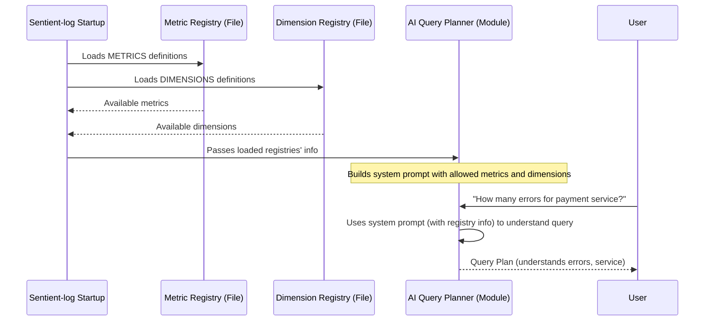

# Chapter 2: Metric and Dimension Registries

In the last chapter, [Authentication & Authorization](01_authentication___authorization_.md), we learned how `Sentient-log` acts like a secure gatekeeper, ensuring only authorized users can access your valuable data. Now that we know *who* can access the system, the next big question is: *What kinds of data* are available, and *how can we talk about them*?

Imagine you're a chef, and you want to cook something delicious. Before you even think about recipes, you need to know what ingredients are available in your pantry and how you can use them. Can you measure the sugar by "cups" or "spoons"? What are the different categories of ingredients (spices, vegetables, meats)?

This is exactly the problem that **Metric and Dimension Registries** solve for `Sentient-log`. They are the "pantry list" and "ingredient dictionary" for all your observability data. They tell `Sentient-log` (and you!) what kinds of measurements (metrics) you can take and what ways you can categorize (dimensions) that data.

### What Problem Do They Solve?

`Sentient-log` is designed to answer complex questions about your applications. For example, you might want to ask:

"**How many errors did my 'payment' service have in the last hour, broken down by status code?**"

For `Sentient-log` to even *begin* to answer this, it needs to understand what each part of your question means:
*   What is an "**error**"? Is it a count, an average, a specific event?
*   What is a "**service**"? How do we identify the 'payment' service?
*   What is "**status code**"? How do we categorize data by it?
*   What does "**last hour**" mean? How do we group data over time?

Without a clear definition, `Sentient-log` would just see a jumble of words. The Metric and Dimension Registries provide this clear, organized vocabulary.

### Breaking Down the "Data Dictionary"

The Metric and Dimension Registries are essentially two distinct, but related, dictionaries that `Sentient-log` uses to understand your data.

#### 1. Metric Registry: What Can You Measure?

The Metric Registry is like a list of all the key performance indicators (KPIs) or measurements you can track in your system. Think of it as defining: "What are the *things* I care about measuring?"

For each "thing" (or metric), the registry tells `Sentient-log`:
*   **What it represents**: Is it errors, latency, or total requests?
*   **How to measure it**: Should we count it, average it, find the highest value?
*   **What are the different ways we can aggregate it**: Can we count errors, but only average latency?

Let's look at some simplified examples of metrics `Sentient-log` might understand:

```python
# From: app/query_engine/metrics_registry.py

# ... (other type definitions)

METRICS: dict[str, MetricDefinition] = {
    "errors": {
        "field": "event_id",
        "aggregation": "count",
        "allowed_aggregations": ["count"],
        "type": "counter",
        "condition": "toInt32OrZero(JSONExtractString(metadata, 'status_code')) >= 500",
        "description": "Server-side failures (status_code >= 500)",
        # ... (output_aliases for easy naming)
    },
    "latency": {
        "field": "latency_ms",
        "aggregation": "avg",
        "allowed_aggregations": ["avg", "p95", "p99", "min", "max"],
        "type": "gauge",
        "condition": None,
        "description": "Request latency in milliseconds",
        # ... (output_aliases for easy naming)
    },
    "requests": {
        "field": "event_id",
        "aggregation": "count",
        "allowed_aggregations": ["count"],
        "type": "counter",
        "condition": None,
        "description": "Total request volume",
        # ... (output_aliases for easy naming)
    },
}

def metric_exists(metric_name: str) -> bool:
    return metric_name in METRICS

def get_metric(metric_name: str) -> MetricDefinition | None:
    return METRICS.get(metric_name)

def allowed_metrics() -> list[str]:
    return sorted(METRICS.keys())
```

In this code:
*   `METRICS` is a Python dictionary where each *key* is the name of a metric (like `"errors"`, `"latency"`).
*   Each metric has a `MetricDefinition`, which tells `Sentient-log` how to interpret it:
    *   `field`: The actual data field in the database (`event_id`, `latency_ms`).
    *   `aggregation`: The *default* way to measure it (e.g., `"count"` for errors, `"avg"` for latency).
    *   `allowed_aggregations`: All the ways this metric *can* be measured (you can count requests, but you wouldn't average them in the same way you average latency).
    *   `type`: Is it a `counter` (always increasing, like total requests) or a `gauge` (can go up and down, like current latency)?
    *   `condition`: A special rule to identify this metric. For "errors," it means "where the status code is 500 or higher."
    *   `description`: A human-readable explanation.
*   Functions like `allowed_metrics()` make it easy for other parts of `Sentient-log` (like the [AI Query Planner](03_ai_query_planner_.md)) to know what metrics are available.

#### 2. Dimension Registry: How Can You Categorize Data?

The Dimension Registry is like a list of all the ways you can "slice and dice" or categorize your data. Think of it as defining: "What are the *categories* I can group my measurements by?"

For each "category" (or dimension), the registry tells `Sentient-log`:
*   **What it represents**: Is it the service name, a specific endpoint, a status code, or the time?
*   **How to extract it**: Where in the raw data do we find this category?
*   **What type of value it is**: Is it a piece of text (string) or a number?

Let's look at some examples of dimensions `Sentient-log` might understand:

```python
# From: app/query_engine/dimensions_registry.py

# ... (other type definitions)

DIMENSIONS: dict[str, DimensionDefinition] = {
    "service": {
        "field_expression": "JSONExtractString(metadata, 'service')",
        "value_type": "string",
    },
    "endpoint": {
        "field_expression": "coalesce(JSONExtractString(metadata, 'endpoint'), url)",
        "value_type": "string",
    },
    "status_code": {
        "field_expression": "toInt32OrZero(JSONExtractString(metadata, 'status_code'))",
        "value_type": "number",
    },
    "environment": {
        "field_expression": "JSONExtractString(metadata, 'environment')",
        "value_type": "string",
    },
}

TIME_DIMENSIONS: dict[str, str] = {
    "minute": "toStartOfMinute(timestamp)",
    "hour": "toStartOfHour(timestamp)",
    "day": "toStartOfDay(timestamp)",
}


def is_dimension_allowed(name: str) -> bool:
    return name in DIMENSIONS or name in TIME_DIMENSIONS

def resolve_dimension_expression(name: str) -> str:
    if name in DIMENSIONS:
        return DIMENSIONS[name]["field_expression"]
    if name in TIME_DIMENSIONS:
        return TIME_DIMENSIONS[name]
    raise KeyError(f"Unknown dimension: {name}")

def allowed_dimensions() -> list[str]:
    return sorted(list(DIMENSIONS.keys()) + list(TIME_DIMENSIONS.keys()))
```

In this code:
*   `DIMENSIONS` is a dictionary where each *key* is the name of a dimension (like `"service"`, `"status_code"`).
*   Each dimension has a `DimensionDefinition`:
    *   `field_expression`: A special instruction for how to extract this value from the raw data. For `"service"`, it means "look for 'service' inside the 'metadata' part of the data." For `"status_code"`, it also converts it to a number.
    *   `value_type`: What kind of data is this (text or number)?
*   `TIME_DIMENSIONS` are special dimensions specifically for grouping data by time (e.g., `"minute"`, `"hour"`, `"day"`). The `field_expression` here helps convert a raw `timestamp` into a specific time bucket.
*   Functions like `allowed_dimensions()` and `resolve_dimension_expression()` help other parts of `Sentient-log` (again, like the [AI Query Planner](03_ai_query_planner_.md)) to discover and correctly use these dimensions.

### Solving Our Use Case with Registries

Let's return to our question: "**How many errors did my 'payment' service have in the last hour, broken down by status code?**"

Here's how `Sentient-log` would use its registries to understand this:

1.  **"How many errors"**:
    *   `Sentient-log` looks up `"errors"` in the `METRICS` registry.
    *   It finds that `"errors"` has a `default aggregation` of `"count"` and a `condition` (`status_code >= 500`). It also knows the `field` to count is `event_id`.
    *   The `allowed_aggregations` tells it that "count" is indeed a valid way to measure errors.

2.  **"'payment' service"**:
    *   `Sentient-log` looks up `"service"` in the `DIMENSIONS` registry.
    *   It finds the `field_expression` `JSONExtractString(metadata, 'service')`. This tells it how to find the service name in the raw data.
    *   It then knows to filter the data where this extracted service name is 'payment'.

3.  **"last hour"**:
    *   `Sentient-log` looks up `"hour"` in the `TIME_DIMENSIONS` registry.
    *   It finds the `field_expression` `toStartOfHour(timestamp)`. This tells it how to group data into hourly buckets.
    *   It also knows to filter for data within the last 60 minutes.

4.  **"broken down by status code"**:
    *   `Sentient-log` looks up `"status_code"` in the `DIMENSIONS` registry.
    *   It finds the `field_expression` `toInt32OrZero(JSONExtractString(metadata, 'status_code'))`. This tells it how to extract the status code as a number.
    *   It knows to group the results by this `status_code` dimension.

This process gives `Sentient-log` a complete understanding of your query, translating your natural language into a structured plan that can then be turned into actual data requests.

### Under the Hood: How the Registries Inform the AI

The Metric and Dimension Registries are foundational because they empower the [AI Query Planner](03_ai_query_planner_.md). The AI doesn't magically know what "errors" or "service" mean; it learns from these registries!

Here's a simple flow of how the registries are used:



#### The AI's "Cheat Sheet"

The [AI Query Planner](03_ai_query_planner_.md) builds a special instruction set for itself, called a "system prompt," based directly on these registries. This prompt acts as a "cheat sheet" that tells the AI exactly what metrics and dimensions it's allowed to use and understand.

Here's a simplified look at how the `_build_system_prompt` function uses the registries:

```python
# From: app/ai/planner.py

# ... (imports)
from app.query_engine.dimensions_registry import allowed_dimensions
from app.query_engine.metrics_registry import allowed_metrics, get_metric

def _build_system_prompt() -> str:
    metrics = allowed_metrics() # Get all allowed metric names
    dimensions = allowed_dimensions() # Get all allowed dimension names

    metric_lines = []
    for metric_name in metrics:
        metric = get_metric(metric_name) # Get detailed info for each metric
        if not metric:
            continue
        metric_lines.append(
            f"- {metric_name}: default={metric['aggregation']} allowed={','.join(metric['allowed_aggregations'])}"
        )

    # ... (code to add few-shot examples)

    return f"""You are an AI observability query planner.
Your ONLY task is to return a valid JSON object matching QueryPlanV2.

ALLOWED METRICS:
{chr(10).join(metric_lines)} # AI sees detailed metric info

ALLOWED DIMENSIONS:
{', '.join(dimensions)} # AI sees all dimension names

# ... (other rules and examples)
"""

SYSTEM_PROMPT = _build_system_prompt()

class Planner:
    # ... (init and other methods)

    async def get_query_plan(self, question: str, intent: QueryType) -> QueryPlanV2:
        response = await self.client.chat.completions.create(
            # ... (model configuration)
            messages=[
                {"role": "system", "content": SYSTEM_PROMPT}, # The AI gets its cheat sheet here!
                {
                    "role": "user",
                    "content": (
                        f"User query: {question}\n"
                        f"Classified intent: {intent}\n"
                        # ...
                    ),
                },
            ],
            # ...
        )
        # ... (process response)
```

The `_build_system_prompt` function gathers all the available metrics and dimensions from their respective registries. It then formats this information into a clear list that is passed to the AI model. This way, when you ask the `Sentient-log` AI a question, it already has a comprehensive vocabulary and set of rules to help it understand and plan your query.

### Conclusion

In this chapter, we've unlocked the "data dictionary" of `Sentient-log`: the **Metric and Dimension Registries**. You've learned that:
*   **Metric Registry** defines *what* you can measure (like 'errors' or 'latency') and *how* you can aggregate those measurements.
*   **Dimension Registry** defines *how* you can categorize or slice your data (like by 'service', 'status_code', or 'hour').
*   These registries provide the fundamental vocabulary that allows `Sentient-log`'s [AI Query Planner](03_ai_query_planner_.md) to understand your natural language questions and turn them into actionable data requests.

Armed with this understanding, you now know how `Sentient-log` makes sense of the vast amounts of data it collects. Next, we'll see how this vocabulary is put into action when the [AI Query Planner](03_ai_query_planner_.md) takes your question and begins to formulate a plan to answer it!

---
