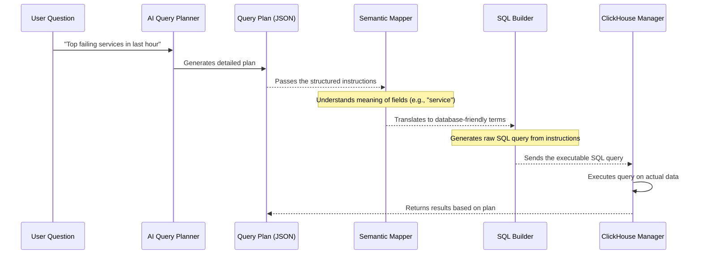

# Chapter 4: Query Plan (QueryPlanV2)

In the last chapter, [AI Query Planner](03_ai_query_planner_.md), we saw how `Sentient-log` uses a smart AI to understand your questions. This AI takes your natural language (like "Show me the top failing services") and turns it into a structured "recipe."

This "recipe" is exactly what we call a **Query Plan (QueryPlanV2)**. Think of it as a super-detailed instruction manual that tells `Sentient-log` *exactly* what data to look for, how to combine it, and how to present it. Without this precise plan, the system wouldn't know how to turn your question into an actual answer.

### What Problem Does It Solve?

Imagine you ask a friend to bake a cake. If you just say, "Bake a cake," they might ask, "What kind? How big? What ingredients do I need? What's the temperature and time?"

Similarly, when the [AI Query Planner](03_ai_query_planner_.md) understands your question, it needs to write down a very clear, step-by-step plan for the rest of `Sentient-log` to follow. This plan must be in a format that computers can easily read and process.

The core problem the Query Plan solves is: **How do we represent a human's complex data request in a simple, structured, and machine-readable format that leaves no room for confusion?**

Let's continue with our example from the previous chapter: **A user wants to ask, "Show me the top failing services in the last hour."**

### Breaking Down the "Instruction Manual"

A `Query Plan (QueryPlanV2)` is like a form you fill out, but for data analysis. Each field on the form tells `Sentient-log` something important about your query.

Here's the complete `QueryPlanV2` object that the [AI Query Planner](03_ai_query_planner_.md) generated for our example question ("Show me the top failing services in the last hour"):

```json
{
  "query_type": "incident_query",
  "intent_tags": ["ranking_query"],
  "metric": "errors",
  "aggregation": "count",
  "filters": {
    "status_code": {"operator": "gte", "value": 500}
  },
  "group_by": ["service"],
  "timeframe": "1h",
  "order_by": {"field": "error_count", "direction": "desc"},
  "limit": 10
}
```

Let's break down each part of this "instruction manual":

#### 1. `query_type` and `intent_tags`: What kind of question is this?

*   **`query_type`**: This is the main purpose of your question. Are you trying to find incidents? See trends over time? Just filter some data?
    *   Example: `"incident_query"` means you're looking for problems or errors.
*   **`intent_tags`**: These are extra labels that give more hints about the query's goal.
    *   Example: `["ranking_query"]` means you want to see things ranked (like "top 10").

#### 2. `metric`: What are we measuring?

*   This tells `Sentient-log` the main thing you want to keep track of. It's like choosing the main ingredient for your recipe.
*   Example: `"errors"` tells the system to focus on error events. (Remember this comes directly from our [Metric and Dimension Registries](02_metric_and_dimension_registries_.md)!)

#### 3. `aggregation`: How do we combine the measurements?

*   Once you choose a `metric`, you need to say *how* to measure it. Do you want to count them, find the average, or get the highest value?
*   Example: `"count"` means we want to count the number of error events.
*   Other options include `"avg"` (average), `"sum"`, `"min"`, `"max"`, `"p95"` (95th percentile, useful for performance).

#### 4. `filters`: Any specific conditions?

*   Filters are like saying, "Only show me data that meets *these* conditions."
*   They are a dictionary (a list of key-value pairs). The key is the dimension name, and the value is the condition.
*   Example:
    ```json
    "filters": {
      "status_code": {"operator": "gte", "value": 500}
    }
    ```
    This means: "Only include data where the `status_code` is **G**reater **T**han or **E**qual to (`gte`) `500`."
*   **`FilterOperator`**: These are keywords that tell `Sentient-log` how to compare values.
    | Operator    | Meaning                  |
    | :---------- | :----------------------- |
    | `"eq"`      | Equal to                 |
    | `"neq"`     | Not equal to             |
    | `"gt"`      | Greater than             |
    | `"gte"`     | Greater than or equal to |
    | `"lt"`      | Less than                |
    | `"lte"`     | Less than or equal to    |
    | `"in"`      | Value is in a list       |
    | `"contains"`| Text contains part       |
*   You can also have simple filters: `{"service": "payment"}` is a shortcut for `{"service": {"operator": "eq", "value": "payment"}}`.

#### 5. `group_by`: How do we break down the data?

*   This tells `Sentient-log` to organize your results into categories. It's like putting all the "spices" together or all the "vegetables" together.
*   Example: `["service"]` means "group the error counts by each unique `service` name."
*   You can group by multiple dimensions, like `["service", "status_code"]`. (These also come from our [Metric and Dimension Registries](02_metric_and_dimension_registries_.md)!)

#### 6. `timeframe`: What time period are we interested in?

*   This sets the time window for your query.
*   Example: `"1h"` means "look at data from the last 1 hour."
*   Other common values include `"5m"` (5 minutes), `"24h"` (24 hours), `"7d"` (7 days).

#### 7. `order_by` and `limit`: How should the results be sorted and trimmed?

*   **`order_by`**: If you want to see "top" or "bottom" results, you need to sort them.
    *   Example: `{"field": "error_count", "direction": "desc"}` means "sort the results by the `error_count` in **desc**ending order (highest first)."
*   **`limit`**: This sets the maximum number of results you want to see.
    *   Example: `10` means "only show the top 10 results after sorting."

### Solving Our Use Case with the Query Plan

Let's revisit our question: "**Show me the top failing services in the last hour.**"

The `Query Plan` generated by the [AI Query Planner](03_ai_query_planner_.md) provides a perfect, unambiguous set of instructions:

```json
{
  "query_type": "incident_query",               // We're looking for an incident (failing)
  "intent_tags": ["ranking_query"],             // We want to rank them (top failing)
  "metric": "errors",                           // The thing to measure is "errors"
  "aggregation": "count",                       // Measure it by "counting" the errors
  "filters": {
    "status_code": {"operator": "gte", "value": 500} // An "error" is defined by status code >= 500
  },
  "group_by": ["service"],                      // Break down the error counts by each "service"
  "timeframe": "1h",                            // Look only at the data from the "last hour"
  "order_by": {"field": "error_count", "direction": "desc"}, // Sort by the error count, highest first (for "top")
  "limit": 10                                   // Only show the "top 10" results
}
```

This `Query Plan` is the "blueprint" that `Sentient-log` will now use to go fetch and process the actual log data.

### Under the Hood: The Query Plan as a Data Model

The `Query Plan` isn't just a simple text string; it's a carefully structured data object defined using Python's `Pydantic` library. `Pydantic` helps ensure that every `Query Plan` created by the [AI Query Planner](03_ai_query_planner_.md) (or any other part of the system) follows a strict format and contains all the necessary information. If a plan doesn't match the expected structure, `Pydantic` will flag it as an error.

Here's a simplified look at how `QueryPlanV2` is defined in `app/query_engine/queryplan.py`:

```python
# app/query_engine/queryplan.py
from typing import Any, Literal
from pydantic import BaseModel, ConfigDict, Field

# Define possible query types
QueryType = Literal["aggregation_query", "ranking_query", "incident_query", ...]

# Define possible aggregation types
AggregationType = Literal["avg", "count", "sum", "p95", ...]

# Define possible filter operators
FilterOperator = Literal["eq", "neq", "gt", "gte", ...]

# Model for a specific filter condition
class FilterCondition(BaseModel):
    operator: FilterOperator
    value: Any

# Model for ordering results
class OrderBy(BaseModel):
    field: str
    direction: Literal["asc", "desc"]

# Main Query Plan definition
class QueryPlanV2(BaseModel):
    model_config = ConfigDict(extra="forbid") # Don't allow extra fields

    query_type: QueryType = "aggregation_query"
    metric: str = Field(default="requests", min_length=1)
    aggregation: AggregationType = "count"
    filters: dict[str, Any] = Field(default_factory=dict) # Can be FilterCondition or direct value
    group_by: list[str] = Field(default_factory=list)
    timeframe: str = Field(default="1h", pattern=r"^\d+[mhd]$")
    order_by: OrderBy | None = None
    limit: int = Field(default=100, ge=1, le=1000)
    # ... (other fields and validation logic)
```
This Python code creates the blueprint for a `Query Plan`. It tells the system:
*   What fields (`query_type`, `metric`, `filters`, etc.) a `Query Plan` must have.
*   What types of values each field should hold (e.g., `query_type` must be one of the `QueryType` literals).
*   Any default values (like `timeframe="1h"`).
*   Any validation rules (like `limit` must be between 1 and 1000).

When the [AI Query Planner](03_ai_query_planner_.md) generates a JSON plan, `Sentient-log` uses this `QueryPlanV2` definition to check if the JSON is valid and then converts it into a Python object that can be easily used by the rest of the system.

This same `QueryPlanV2` structure is also shared with the frontend to help display and understand the queries:

```typescript
// frontend/src/types/index.ts
export interface OrderBy {
  field: string;
  direction: "asc" | "desc";
}

export interface QueryPlan { // This matches QueryPlanV2 from backend
  query_type:
    | "aggregation_query"
    | "ranking_query"
    | "incident_query"
    | string; // And others from QueryType
  intent_tags?: string[];
  metric: string;
  aggregation: "avg" | "count" | "sum" | string; // And others from AggregationType
  filters: Record<string, any>;
  group_by: string[];
  order_by?: OrderBy;
  limit: number;
  timeframe: string;
}
```
As you can see, the TypeScript definition in the frontend mirrors the Python definition in the backend, ensuring that both parts of `Sentient-log` speak the same language when it comes to understanding a query plan.

### The Query Plan's Journey

Once the `Query Plan` is generated, it becomes the central piece of information that guides all subsequent steps in answering your question.



This diagram shows that the `Query Plan` acts as the handshake between the AI's understanding and the actual data processing. It's the common language spoken by different parts of the `Sentient-log` system.

### Conclusion

In this chapter, we've unpacked the crucial **Query Plan (QueryPlanV2)**. You've learned that it's:
*   A **detailed instruction manual** created by the [AI Query Planner](03_ai_query_planner_.md) from your natural language question.
*   Structured with precise fields like `metric`, `aggregation`, `filters`, `group_by`, `timeframe`, `order_by`, and `limit`.
*   The **blueprint** that guides all subsequent steps in `Sentient-log` to fetch and present the exact data you requested.

Understanding the Query Plan is key to seeing how `Sentient-log` transforms a human thought into an actionable data request. Now that we have this precise plan, the next step is to prepare it for the database. Get ready to explore how `Sentient-log` translates these high-level instructions into concrete database field names in [Chapter 5: Semantic Mapper](05_semantic_mapper_.md)!

---
