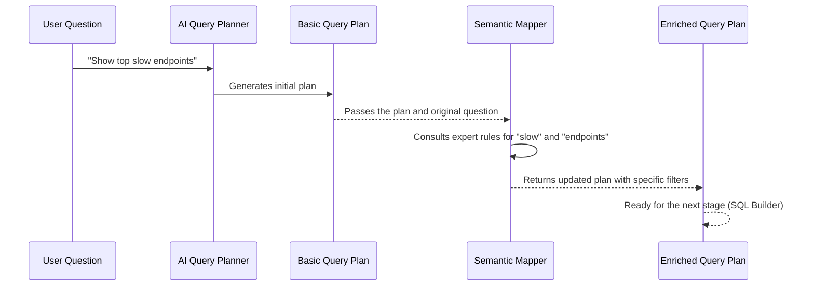

# Chapter 5: Semantic Mapper

In our last chapter, [Query Plan (QueryPlanV2)](04_query_plan__queryplanv2__.md), we learned how the [AI Query Planner](03_ai_query_planner_.md) transforms your natural language question into a structured "recipe" called a `Query Plan`. This plan is a detailed list of instructions like "measure errors," "count them," and "group by service."

But imagine you're a beginner cook, and you get a recipe that says, "Make the sauce *rich*." What does "rich" mean? Does it mean add more butter? More cream? A professional chef would know exactly what ingredients and techniques to add to make it "rich" in that specific context.

This is exactly what the **Semantic Mapper** does for `Sentient-log`. It's like an "expert chef" who takes the basic `Query Plan` from the AI and adds more specific, industry-standard details and "secret ingredients" based on common observability knowledge. It refines the plan, ensuring accurate and meaningful analysis even from broad questions.

### What Problem Does It Solve?

The [AI Query Planner](03_ai_query_planner_.md) is very smart at understanding your intent and building a foundational `Query Plan`. However, observability queries often have implied meanings or standard definitions that aren't explicitly stated in the initial question.

For example, when you say "slow," what does that *really* mean in terms of milliseconds? When you say "failing," what specific HTTP status codes indicate a failure? The AI might not always add these precise, domain-specific details by default.

The core problem the Semantic Mapper solves is: **How do we inject deeper, predefined observability domain knowledge and specific rules into the `Query Plan` to make it more accurate, complete, and aligned with industry best practices?**

Let's use a common situation as our main example: **A user asks, "Show me the top slow endpoints."**

### Breaking Down the "Expert Interpreter"

The Semantic Mapper acts as a refinement layer, enriching the `Query Plan` with specific details. Here's how it works:

1.  **Starts with a Basic Plan**: It receives the `Query Plan` that the [AI Query Planner](03_ai_query_planner_.md) generated.
2.  **Analyzes Original Query**: It also looks at your *original natural language question* for keywords and phrases.
3.  **Applies Expert Rules**: It has a set of predefined "expert rules" or "templates" that map common observability phrases (like "slow," "failing services," "auth failures") to concrete `Query Plan` modifications (like adding specific filters or changing default aggregations).
4.  **Refines the Plan**: It updates the `Query Plan` by adding these specific details, filling in any gaps, or overriding less precise AI inferences with more exact, standard definitions.

### How the Semantic Mapper Solves Our Use Case

Let's see how the Semantic Mapper would take a basic `Query Plan` and refine it for our example question: "**Show me the top slow endpoints.**"

#### Initial Query Plan (from AI Query Planner)

The [AI Query Planner](03_ai_query_planner_.md) might produce a `Query Plan` that looks like this:

```json
{
  "query_type": "ranking_query",
  "metric": "latency",
  "aggregation": "avg",
  "group_by": ["path"],
  "timeframe": "1h",
  "order_by": {"field": "avg_latency", "direction": "desc"},
  "limit": 10
}
```
This plan is good! It correctly identified the `metric` as "latency," wants to `group_by` "path" (for endpoints), and `order_by` for "top" results. However, it doesn't specify *how slow* "slow" is.

#### After Semantic Mapper (Enriched Query Plan)

The Semantic Mapper steps in, sees the original query "Show me the top slow endpoints," and recognizes the keyword "slow." It knows from its expert rules that "slow" in an observability context usually means `latency` greater than a certain threshold, like `1000ms`.

It then adds this crucial filter to the plan:

```json
{
  "query_type": "ranking_query",
  "metric": "latency",
  "aggregation": "avg",
  "filters": { // <--- Semantic Mapper added this!
    "latency": {"operator": "gt", "value": 1000}
  },
  "group_by": ["path"],
  "timeframe": "1h",
  "order_by": {"field": "avg_latency", "direction": "desc"},
  "limit": 10
}
```
Now, the `Query Plan` is much more precise! It doesn't just look for "latency"; it specifically looks for `latency > 1000` milliseconds, which is an industry-standard definition for "slow." This ensures `Sentient-log` provides truly meaningful results.

### Under the Hood: How the Semantic Mapper Works

Let's peek behind the curtain to see how the Semantic Mapper applies its expert knowledge.

Here's a simplified flow of how the Semantic Mapper fits into the overall query processing:



The Semantic Mapper doesn't just randomly add things; it uses two main sources of predefined "expert knowledge":

#### 1. Semantic Templates: Predefined Phrases with Default Plans

In `app/query_engine/semantic_registry.py`, there's a list called `SEMANTIC_TEMPLATES`. These are like full "recipe cards" for common phrases. If a user's query contains one of these phrases, the Semantic Mapper will apply many of its suggested `Query Plan` fields.

Here's an example:

```python
# From: app/query_engine/semantic_registry.py

# ... (other code)

SEMANTIC_TEMPLATES: tuple[SemanticTemplate, ...] = (
    SemanticTemplate(
        phrase="failing services", # If query contains "failing services"
        query_type="incident_query",
        metric="errors",
        aggregation="count",
        group_by=("service",),
        default_limit=10,
        rank_desc=True,
        filters={"status_code": ("gte", 500)}, # THEN add this specific filter!
    ),
    SemanticTemplate(
        phrase="slow endpoints", # If query contains "slow endpoints"
        query_type="latency_query",
        metric="latency",
        aggregation="avg",
        group_by=("path",),
        default_limit=10,
        rank_desc=True,
        filters={"latency": ("gt", 1000)}, # THEN add this specific filter!
    ),
    # ... more templates ...
)

def find_template(query: str) -> SemanticTemplate | None:
    normalized = query.lower()
    for template in SEMANTIC_TEMPLATES:
        if template.phrase in normalized:
            return template
    return None
```
The `find_template` function checks if any of these predefined `phrase`s are in the user's original question. If "slow endpoints" is found, the mapper knows to set the `metric` to "latency," `group_by` "path," and crucially, add the `filters` that define "slow" as `latency > 1000`.

#### 2. Vocabulary Filters: Individual Keywords for Specific Filters

There's also `VOCABULARY_FILTERS` in the same file. These are for more granular, single-word or short-phrase matches that add specific filters without necessarily defining the whole query type.

```python
# From: app/query_engine/semantic_registry.py

# ... (other code)

VOCABULARY_FILTERS: dict[str, tuple[str, object, str]] = {
    "errors": ("gte", 500, "status_code"),      # "errors" implies status_code >= 500
    "failures": ("gte", 500, "status_code"),
    "500 errors": ("gte", 500, "status_code"),
    "5xx": ("gte", 500, "status_code"),
    "slow requests": ("gt", 1000, "latency"),   # "slow requests" implies latency > 1000
    "rate limits": ("eq", 429, "status_code"),
    # ... more vocabulary filters ...
}


def iter_vocabulary_matches(query: str) -> list[tuple[str, str, object]]:
    normalized = query.lower()
    matches: list[tuple[str, str, object]] = []
    for token, (operator, value, field) in VOCABULARY_FILTERS.items():
        if token in normalized: # Check if the keyword is in the query
            matches.append((field, operator, value)) # Add the corresponding filter
    return matches
```
The `iter_vocabulary_matches` function finds keywords like "slow requests" in the user's query and suggests specific filters (e.g., `latency > 1000`). This allows the mapper to pick up subtle hints in the query.

#### The `enrich` Method: Putting it all Together

The `SemanticMapper` class (in `app/query_engine/semantic_mapper.py`) has an `enrich` method that ties these rules together.

```python
# From: app/query_engine/semantic_mapper.py
import re
from app.query_engine.queryplan import FilterCondition, OrderBy, QueryPlanV2
from app.query_engine.semantic_registry import find_template, iter_vocabulary_matches

class SemanticMapper:
    """Maps observability vocabulary into explicit structured query fields."""

    @classmethod
    def enrich(cls, query: str, plan: QueryPlanV2) -> QueryPlanV2:
        normalized_query = query.lower()

        # 1. Apply full templates first (e.g., "slow endpoints")
        template = find_template(normalized_query)
        if template:
            if template.metric: plan.metric = template.metric
            if template.aggregation: plan.aggregation = template.aggregation
            if template.group_by: plan.group_by = list(template.group_by)
            # ... apply other template fields like default_limit, timeframe ...
            if template.filters:
                for field, (operator, value) in template.filters.items():
                    plan.filters[field] = FilterCondition(operator=operator, value=value)

        # 2. Infer specific filters from vocabulary keywords (e.g., just "slow")
        semantic_filters = cls._infer_semantic_filters(normalized_query)
        for key, value in semantic_filters.items():
            if key not in plan.filters: # Don't overwrite existing filters
                plan.filters[key] = value

        # 3. Add default grouping for "service" or "endpoint/path" if not already set
        if "service" in normalized_query and not plan.group_by:
            plan.group_by = ["service"]
        if ("endpoint" in normalized_query or "path" in normalized_query) and not plan.group_by:
            plan.group_by = ["path"]

        # 4. Handle other common patterns like "all 500" or "error rate highest"
        if "all 500" in normalized_query:
            plan.query_type = "filtering_query"
            plan.metric = "errors"
            plan.aggregation = "count"
            plan.filters["status_code"] = FilterCondition(operator="gte", value=500)

        # 5. Ensure ordering for "top" or "highest" queries
        if "top" in normalized_query or "highest" in normalized_query:
            # Assumes the metric and aggregation are already set
            plan.order_by = OrderBy(field=cls._alias_for(plan.metric, plan.aggregation), direction="desc")

        # ... (more refinement rules)

        return QueryPlanV2.model_validate(plan.model_dump()) # Return the refined plan
```
The `enrich` method first tries to apply broader `SEMANTIC_TEMPLATES`. Then, it uses `_infer_semantic_filters` (which uses `VOCABULARY_FILTERS`) to add more specific filters based on individual keywords. It also includes other "hardcoded" rules for common observability patterns, like automatically grouping by "service" if the query mentions "service" but `group_by` is empty.

For our "slow endpoints" example, the `template = find_template(normalized_query)` call would find the "slow endpoints" template and directly apply `filters={"latency": ("gt", 1000)}`. This means the Semantic Mapper automatically adds that crucial detail, making the query plan complete and accurate.

#### Integration in the API

The `SemanticMapper.enrich` method is called as a crucial step in the overall query processing pipeline within `app/api/query.py`, right after the [AI Query Planner](03_ai_query_planner_.md) generates the initial `Query Plan`.

```python
# From: app/api/query.py (inside query_logs function)
# ... other imports ...
from app.ai.planner import Planner
from app.query_engine.semantic_mapper import SemanticMapper # Import the SemanticMapper

# ... other setup ...

@router.post("/query", response_model=QueryResponse)
async def query_logs(
    payload: QueryRequest,
    # ... other dependencies ...
):
    try:
        # 1. Intent classification
        intent = IntentClassifier.classify(payload.question)
        intent_tags = IntentClassifier.classify_secondary(payload.question, intent)

        # 2. AI planner generates constrained QueryPlan V2
        query_plan = await planner.get_query_plan(payload.question, intent)
        query_plan.intent_tags = intent_tags

        # 3. Semantic mapping layer normalizes observability terms
        # This is where our expert interpreter refines the plan!
        query_plan = SemanticMapper.enrich(payload.question, query_plan)

        # 4. Validation engine enforces safety and schema correctness
        # ... (rest of the pipeline) ...
```
As you can see, the `query_plan` is passed to `SemanticMapper.enrich()` along with the `payload.question` (the original user query). The `enrich` method then returns a modified, more complete `query_plan` that moves on to the next stages of processing.

### Conclusion

In this chapter, we've uncovered the role of the **Semantic Mapper**. You've learned that it acts as an "expert interpreter" for `Sentient-log`, taking the `Query Plan` generated by the [AI Query Planner](03_ai_query_planner_.md) and refining it with precise, industry-standard definitions and rules. This ensures that even high-level questions like "slow endpoints" are translated into specific, actionable queries (e.g., `latency > 1000ms`).

This crucial step adds valuable domain knowledge, making `Sentient-log`'s answers more accurate and useful. Now that our `Query Plan` is fully enriched and detailed, the next step is to translate it into the language the database understands. Get ready to learn about the [SQL Builder](06_sql_builder_.md)!

---
