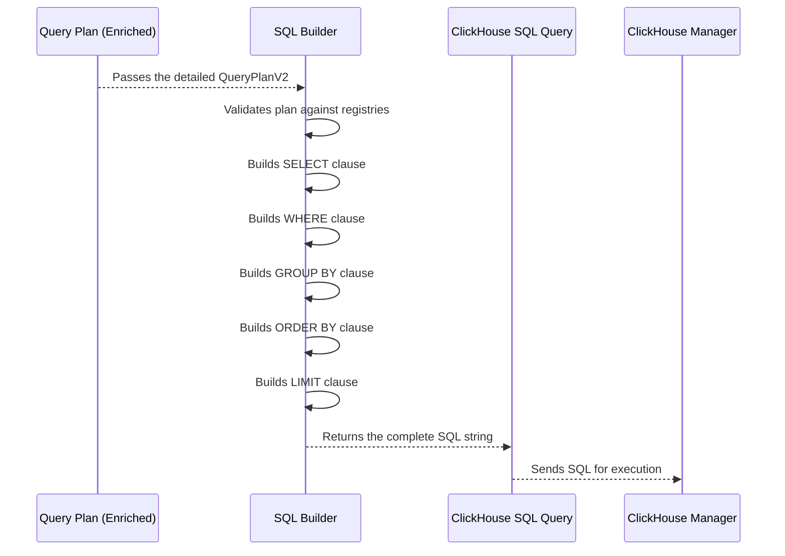

# Chapter 6: SQL Builder

In our last chapter, [Semantic Mapper](05_semantic_mapper_.md), we saw how `Sentient-log` takes the `Query Plan` (your detailed instruction manual) and enriches it with expert observability knowledge, turning a general idea like "slow endpoints" into a precise `latency > 1000` filter. Now, we have a perfectly refined plan!

But there's one more crucial step: Databases don't understand "metric: latency" or "group_by: service." They speak a very specific language called **SQL** (Structured Query Language). SQL is how you actually *ask* the database to fetch and process data.

This is exactly what the **SQL Builder** does for `Sentient-log`. It's the "construction worker" that takes the final, validated `Query Plan` (the blueprint) and translates it into a precise, executable database query in ClickHouse SQL (the specific type of SQL our database understands).

### What Problem Does It Solve?

Imagine you have a detailed blueprint for a house. It tells you exactly where the walls go, how many windows, and what kind of roof. But to actually *build* the house, you need to tell the construction crew very specific commands: "Dig here," "Pour concrete there," "Raise that wall."

Similarly, the `Query Plan` is an excellent blueprint, but the ClickHouse database needs very explicit instructions. The core problem the SQL Builder solves is: **How do we convert the high-level, human-friendly components of a `Query Plan` (like metrics, filters, and groupings) into the precise, machine-readable SQL commands that the database can understand and execute?**

Let's continue with our example: **A user asks, "Show me the top slow endpoints."**

### Breaking Down the "Construction Worker"

The SQL Builder is like a specialized translator. It knows exactly how to read each part of a `Query Plan` and turn it into the corresponding SQL command.

Here's how it generally works:

1.  **Input**: It receives the refined `Query Plan` (the blueprint).
2.  **Lookup**: It consults the [Metric and Dimension Registries](02_metric_and_dimension_registries_.md) to get the actual database field names and expressions for metrics and dimensions (e.g., `latency` becomes `latency_ms`, `service` becomes `JSONExtractString(metadata, 'service')`).
3.  **Translate**: It converts each component of the `Query Plan` into a specific part of a SQL query:
    *   `metric` and `aggregation` become `SELECT` clauses.
    *   `filters` and `timeframe` become `WHERE` clauses.
    *   `group_by` becomes `GROUP BY` clauses.
    *   `order_by` becomes `ORDER BY` clauses.
    *   `limit` becomes a `LIMIT` clause.
4.  **Output**: It produces a complete, ready-to-execute ClickHouse SQL query string.

### How the SQL Builder Solves Our Use Case

Let's take the enriched `Query Plan` for our question, "**Show me the top slow endpoints,**" and see how the SQL Builder converts it into SQL.

#### The Enriched Query Plan (from Semantic Mapper)

```json
{
  "query_type": "ranking_query",
  "metric": "latency",
  "aggregation": "avg",
  "filters": {
    "latency": {"operator": "gt", "value": 1000}
  },
  "group_by": ["path"],
  "timeframe": "1h",
  "order_by": {"field": "avg_latency", "direction": "desc"},
  "limit": 10
}
```

#### SQL Builder's Translation Steps:

1.  **Metric & Aggregation (`SELECT`)**:
    *   `metric`: "latency" -> Database field `latency_ms`
    *   `aggregation`: "avg" -> SQL function `avg()`
    *   Result: `avg(latency_ms) AS avg_latency`

2.  **Filters (`WHERE`)**:
    *   `timeframe`: "1h" -> SQL condition `timestamp >= now() - INTERVAL 1 HOUR`
    *   `filters`: `latency` (which maps to `latency_ms`) `gt` (`>`) `1000` -> SQL condition `latency_ms > 1000`
    *   Resulting `WHERE` clause combines these: `WHERE timestamp >= now() - INTERVAL 1 HOUR AND latency_ms > 1000`

3.  **Group By (`GROUP BY`)**:
    *   `group_by`: ["path"] -> Dimension registry resolves "path" to `JSONExtractString(metadata, 'path')`
    *   Result: `GROUP BY JSONExtractString(metadata, 'path')` (and also adds it to `SELECT` as `JSONExtractString(metadata, 'path') AS path`)

4.  **Order By (`ORDER BY`)**:
    *   `order_by`: `field`: "avg_latency", `direction`: "desc" -> `ORDER BY avg_latency DESC`

5.  **Limit (`LIMIT`)**:
    *   `limit`: 10 -> `LIMIT 10`

#### The Final ClickHouse SQL Query:

```sql
SELECT
  JSONExtractString(metadata, 'path') AS path,
  avg(latency_ms) AS avg_latency
FROM events
WHERE
  timestamp >= now() - INTERVAL 1 HOUR
  AND latency_ms > 1000
GROUP BY
  JSONExtractString(metadata, 'path')
ORDER BY
  avg_latency DESC
LIMIT 10
```
This is a complete and valid SQL query that the ClickHouse database can directly execute to fetch the top 10 slowest endpoints from the last hour, based on their average latency!

### Under the Hood: How the SQL Builder Works

Let's dive into the core components of the `SqlBuilder` in `Sentient-log`.

Here's a simplified sequence of how the SQL Builder integrates into the overall query pipeline:



The `SqlBuilder` class (found in `app/analytics/sql_builder.py`) is responsible for this translation.

#### 1. Initializing and Validating the Plan

When you create a `SqlBuilder` instance, it immediately checks if the metric requested in the `Query Plan` actually exists in the [Metric and Dimension Registries](02_metric_and_dimension_registries_.md). This prevents trying to build a query for something the system doesn't understand.

```python
# From: app/analytics/sql_builder.py

# ... (imports)
from app.query_engine.dimensions_registry import resolve_dimension_expression
from app.query_engine.metrics_registry import get_metric, metric_output_alias
from app.query_engine.queryplan import FilterCondition, QueryPlanV2

class SqlBuilderError(Exception):
    pass

class SqlBuilder:
    def __init__(self, plan: QueryPlanV2):
        self.plan = plan
        # Get the detailed definition of the metric from the registry
        self.metric_definition = get_metric(plan.metric)
        if not self.metric_definition:
            # If the metric isn't found, raise an error immediately
            raise SqlBuilderError(f"Unknown metric: {plan.metric}")

    def build(self) -> str:
        # Before building SQL, run more checks
        self._validate() 

        # ... (rest of the build method)
```
The `_validate` method performs further checks, for instance, ensuring that the chosen `aggregation` (like "avg") is actually `allowed_aggregations` for the specified `metric` (e.g., you can't sum a `p95` metric). It also verifies that all `group_by` dimensions are valid.

#### 2. Building the `SELECT` Clause

This method constructs the part of the SQL query that specifies *what data to retrieve* and *how to aggregate it*. It uses the `metric` and `aggregation` from the `Query Plan`, plus any `group_by` dimensions.

```python
# From: app/analytics/sql_builder.py (inside SqlBuilder class)

    def _build_select(self) -> str:
        select_parts = []
        group_by_expressions = []

        if self.plan.group_by:
            for dimension in self.plan.group_by:
                # Get the actual database expression for the dimension
                expression = resolve_dimension_expression(dimension)
                group_by_expressions.append(expression)
                select_parts.append(f"{expression} AS {dimension}") # Add to SELECT with an alias

        agg = self.plan.aggregation
        metric_field = self.metric_definition["field"] # Get the raw field like "latency_ms"
        alias = metric_output_alias(self.plan.metric, agg) # Get the friendly output name like "avg_latency"

        # Construct the aggregation function based on the plan
        if agg == "p95":
            agg_expression = f"quantile(0.95)({metric_field})"
        elif agg == "count":
            agg_expression = f"count({metric_field})"
        else:
            agg_expression = f"{agg}({metric_field})" # e.g., avg(latency_ms)

        select_parts.append(f"{agg_expression} AS {alias}") # Add aggregation to SELECT

        self._group_by_expressions = group_by_expressions # Store for later use in GROUP BY
        return ", ".join(select_parts)
```
Notice how `resolve_dimension_expression(dimension)` from the [Dimension Registry](02_metric_and_dimension_registries_.md) is used to get the actual ClickHouse function for dimensions like `path` (which might be `JSONExtractString(metadata, 'path')`).

#### 3. Building the `WHERE` Clause

This method constructs the conditions that filter the data. It combines the `timeframe`, any `metric` specific conditions, and the `filters` from the `Query Plan`.

```python
# From: app/analytics/sql_builder.py (inside SqlBuilder class)

    def _build_where(self) -> str:
        conditions = [self._build_timeframe_condition()] # Always start with time filter

        metric_condition = self.metric_definition.get("condition")
        if metric_condition:
            conditions.append(metric_condition) # Add any specific metric conditions (e.g., status_code >= 500 for "errors")

        for field, value in self.plan.filters.items():
            expression = self._resolve_filter_expression(field) # Get the database field for the filter
            if isinstance(value, FilterCondition):
                # Handle filters like {"latency": {"operator": "gt", "value": 1000}}
                conditions.append(self._build_operator_condition(expression, value))
            else:
                # Handle simple filters like {"service": "payment"}
                conditions.append(f"{expression} = {self._format_literal(value)}")

        # Remove duplicates and join with AND
        deduped_conditions = list(dict.fromkeys(conditions))
        return " AND ".join(deduped_conditions)

    # Helper to convert timeframe like "1h" to SQL
    def _build_timeframe_condition(self) -> str:
        # ... (regex to parse timeframe and build "timestamp >= now() - INTERVAL 1 HOUR")
        value = 1 # Example for "1h"
        unit = "HOUR" # Example for "1h"
        return f"timestamp >= now() - INTERVAL {value} {unit}"

    # Helper to get the actual database field for a filter
    def _resolve_filter_expression(self, field: str) -> str:
        if field == "latency":
            return "latency_ms" # Specific mapping for latency
        return resolve_dimension_expression(field) # Use Dimension Registry for others

    # Helper to convert operators like "gt" to ">"
    def _build_operator_condition(self, expression: str, value: FilterCondition) -> str:
        op_map = {
            "eq": "=", "neq": "!=", "gt": ">", "gte": ">=", "lt": "<", "lte": "<=",
        }
        if value.operator in op_map:
            return f"{expression} {op_map[value.operator]} {self._format_literal(value.value)}"
        # ... (logic for "contains", "in" operators)
        return "" # Simplified

    # Helper to correctly format values for SQL (e.g., add quotes for strings)
    def _format_literal(self, value: object) -> str:
        if isinstance(value, str):
            safe_val = value.replace("'", "''") # Escape single quotes
            return f"'{safe_val}'"
        return str(value) # For numbers, booleans, etc.
```
The `_build_timeframe_condition` converts timeframes (like "1h") into ClickHouse's `INTERVAL` syntax. `_resolve_filter_expression` looks up the real database column or expression for a filter field. `_build_operator_condition` maps the `FilterOperator` (like `gt`) to the correct SQL symbol (`>`). Finally, `_format_literal` ensures that values (especially strings) are correctly formatted for the database.

Here's a quick table for the filter operator mapping:

| `FilterOperator` | SQL Equivalent |
| :--------------- | :------------- |
| `"eq"`           | `=`            |
| `"neq"`          | `!=`           |
| `"gt"`           | `>`            |
| `"gte"`          | `>=`           |
| `"lt"`           | `<`            |
| `"lte"`          | `<=`           |
| `"contains"`     | `LIKE '%...%'` |
| `"in"`           | `IN (...)`     |

#### 4. Building `GROUP BY`, `ORDER BY`, and `LIMIT`

These methods are more straightforward, directly translating the corresponding `Query Plan` fields into their SQL equivalents.

```python
# From: app/analytics/sql_builder.py (inside SqlBuilder class)

    def _build_group_by(self) -> str:
        if not self.plan.group_by:
            return ""
        # Uses the expressions saved from _build_select
        return ", ".join(self._group_by_expressions)

    def _build_order_by(self) -> str:
        if not self.plan.order_by:
            return ""
        direction = self.plan.order_by.direction.upper() # "desc" -> "DESC"
        return f"{self.plan.order_by.field} {direction}"

    def build(self) -> str:
        # ... (other clauses)
        limit_clause = f"LIMIT {self.plan.limit}"
        # ... (assemble full SQL)
```

#### Integration with the API

The `SqlBuilder` is called in `app/api/query.py` right after the [Semantic Mapper](05_semantic_mapper_.md) has enriched the `Query Plan` and the plan has been validated.

```python
# From: app/api/query.py
# ... other imports ...
from app.analytics.sql_builder import SqlBuilder, SqlBuilderError # Import SqlBuilder

@router.post("/query", response_model=QueryResponse)
async def query_logs(
    # ... (payload, user, etc.)
):
    try:
        # 1. Intent classification
        # 2. AI planner generates QueryPlan
        # 3. Semantic mapping layer enriches QueryPlan
        query_plan = SemanticMapper.enrich(payload.question, query_plan)

        # 4. Validation engine (ensures plan is safe and correct)
        # ... (validation_result logic)

        logger.info(f"Generated QueryPlan: {query_plan.model_dump_json()}")

        # 5. Deterministic SQL generation
        # Here, the SqlBuilder takes the validated QueryPlan
        builder = SqlBuilder(query_plan)
        sql = builder.build() # And builds the final SQL query!
        logger.info(f"Generated SQL: {sql}")

        # 6. Execute on ClickHouse
        # ... (results are fetched using the 'sql')
        
        # ... (rest of the pipeline)
    except SqlBuilderError as e:
        # Catch errors from the SQL Builder
        raise HTTPException(status_code=400, detail=f"Invalid query plan: {str(e)}")
    # ... (other error handling)
```
As you can see, the `SqlBuilder` sits at a critical point in the `Sentient-log` pipeline. It's the final step before the actual data query is sent to the database.

### Conclusion

In this chapter, we've explored the role of the **SQL Builder** in `Sentient-log`. You've learned that it's the "construction worker" that takes the detailed `Query Plan` (the blueprint) and translates it into a precise ClickHouse SQL query (the executable commands). It uses the [Metric and Dimension Registries](02_metric_and_dimension_registries_.md) to find the correct database fields and functions, ensuring that the database fetches exactly the data specified by your query plan.

With the SQL query now generated, `Sentient-log` is ready to talk to the database! Next, we'll see how the system connects to and interacts with the powerful ClickHouse database in [Chapter 7: ClickHouse Manager](07_clickhouse_manager_.md).

---