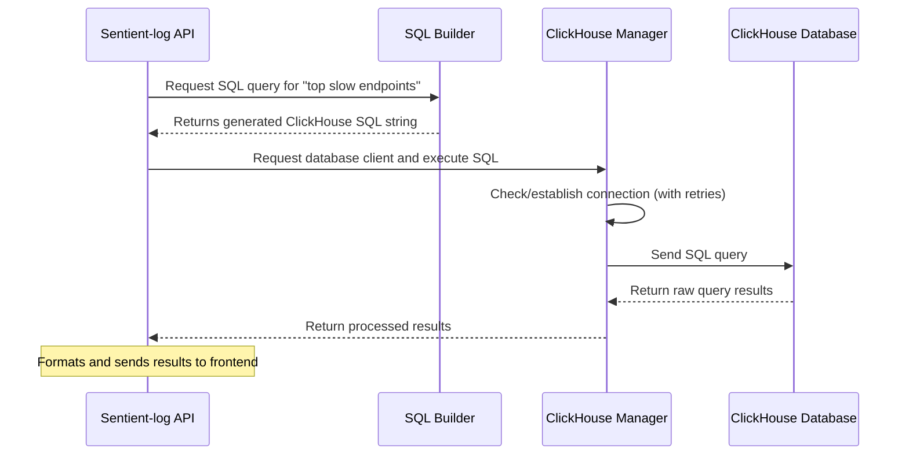

# Chapter 7: ClickHouse Manager

In our last chapter, [SQL Builder](06_sql_builder_.md), we witnessed how `Sentient-log` meticulously crafted a perfect ClickHouse SQL query from your natural language question. This SQL query is like a detailed instruction sheet for the database: "Go to this specific shelf, find these books, organize them this way, and give me the top 10."

Now, who actually *takes* that instruction sheet, *goes* to the ClickHouse database, *runs* the query, and *brings back* the results? That's the job of the **ClickHouse Manager**!

Think of the ClickHouse Manager as the highly skilled **Librarian** for our super-fast, analytical library (ClickHouse). You wouldn't just send a junior assistant to a complex, constantly evolving library without a guide, right? The Librarian knows exactly how to connect, ensures everything is in its place, and handles any issues that might come up.

### What Problem Does It Solve?

Connecting to and interacting with a database can be tricky. You need to:
1.  Know the exact address, username, and password.
2.  Handle situations where the database might be temporarily unavailable.
3.  Make sure the database tables are set up correctly before you try to use them.
4.  Efficiently send queries and receive results.

The core problem the ClickHouse Manager solves is: **How do we make interacting with the ClickHouse database reliable, efficient, and simple for the rest of `Sentient-log`, abstracting away all the complex connection and setup details?**

Let's use our ongoing example: **`Sentient-log` needs to execute the SQL query generated by the [SQL Builder](06_sql_builder_.md) to get the "top slow endpoints" from the ClickHouse database.**

### Breaking Down the "Librarian"

The ClickHouse Manager (`ClickHouseManager`) is a dedicated component that handles all database-related tasks. It's built to be robust and performant.

#### 1. Connection Management: Getting the Key to the Library

The first job is to establish and maintain a connection to the ClickHouse database. This isn't just a simple connection; it involves:
*   Reading connection details (host, port, username, password) from `Sentient-log`'s settings.
*   Using an asynchronous client (`clickhouse_connect.driver.asyncclient.AsyncClient`) so other tasks can run at the same time.
*   Ensuring only one connection is used across the entire application, preventing resource waste.

#### 2. Migrations: Setting Up the Shelves

Before you can query data, the tables where the data lives must exist. The ClickHouse Manager handles this by running "migrations." These are like setup instructions that ensure the necessary tables (like `events` for `Sentient-log`'s log data) are created, and their structure (schema) is correct. It's like the librarian making sure the shelves are built and labeled before the books arrive.

#### 3. Robustness with Retries: When the Door Gets Stuck

What if the ClickHouse database is momentarily unavailable or slow to respond? Instead of crashing, the ClickHouse Manager is designed with **retry mechanisms**. This means it will automatically try connecting or running a query again after a short wait, several times, before giving up. This makes the system much more resilient.

#### 4. Executing Queries and Insertions: Finding and Storing Books

Once connected and the tables are ready, the Manager provides simple methods to:
*   **`command(sql_query)`**: Execute any SQL command, like `CREATE TABLE` or complex `SELECT` queries.
*   **`insert(table, data)`**: Efficiently insert new data into tables.

### How the ClickHouse Manager Solves Our Use Case

Let's revisit our use case: `Sentient-log` needs to execute the SQL query generated by the [SQL Builder](06_sql_builder_.md) to get the "top slow endpoints."

The `SqlBuilder` gave us this beautiful SQL:

```sql
SELECT
  JSONExtractString(metadata, 'path') AS path,
  avg(latency_ms) AS avg_latency
FROM events
WHERE
  timestamp >= now() - INTERVAL 1 HOUR
  AND latency_ms > 1000
GROUP BY
  JSONExtractString(metadata, 'path')
ORDER BY
  avg_latency DESC
LIMIT 10
```

Here's how `Sentient-log` uses the `ClickHouseManager` to execute this query:

1.  The `Sentient-log` API (specifically the `/api/v1/query` endpoint) gets the SQL query string from the [SQL Builder](06_sql_builder_.md).
2.  It then asks the `ClickHouseManager` for a client connection. The Manager ensures it gets a valid, active connection.
3.  It passes the SQL query to this client connection for execution.
4.  The client executes the query on ClickHouse.
5.  ClickHouse processes the data and returns the results.
6.  The `ClickHouseManager` then delivers these results back to the API, which can then format and send them to the frontend.

It's a seamless process thanks to the `ClickHouseManager` handling all the underlying complexities.

### Under the Hood: The ClickHouse Manager in Action

Let's trace the journey of a query request through the `ClickHouseManager`.



The `ClickHouseManager` is implemented as a **singleton** in `app/clickhouse/client.py`. A singleton means there's only one instance of the manager throughout the entire `Sentient-log` application, making sure all parts of the system share the same, well-managed database connection.

#### 1. Connecting to ClickHouse (`get_client`)

The `get_client` method is the heart of the connection logic. It checks if a client is already connected; if not, it establishes a new connection using the configuration settings. Notice the `@retry` decorator – this is what makes it so robust!

```python
# From: app/clickhouse/client.py
import logging
from clickhouse_connect.driver.asyncclient import AsyncClient
from tenacity import retry, wait_exponential, stop_after_attempt, retry_if_exception_type
from app.core.config import settings

logger = logging.getLogger(__name__)

class ClickHouseManager:
    _instance = None
    _client: AsyncClient | None = None

    def __new__(cls):
        # This ensures only one instance of ClickHouseManager exists
        if cls._instance is None:
            cls._instance = super(ClickHouseManager, cls).__new__(cls)
        return cls._instance

    @retry( # If connection fails, retry with exponential backoff!
        wait=wait_exponential(multiplier=1, min=2, max=10),
        stop=stop_after_attempt(10), # Try up to 10 times
        retry=retry_if_exception_type(Exception),
        reraise=True # Re-raise if all retries fail
    )
    async def get_client(self) -> AsyncClient:
        if self._client is None:
            logger.info("Initializing ClickHouse async client...")
            self._client = await clickhouse_connect.get_async_client(
                host=settings.CLICKHOUSE_URL, # From docker-compose.yml or environment
                port=settings.CLICKHOUSE_PORT,
                username=settings.CLICKHOUSE_USER,
                password=settings.CLICKHOUSE_PASSWORD,
                database=settings.CLICKHOUSE_DATABASE,
                send_receive_timeout=30, # Increased timeout for slow queries
                settings={"enable_json_type": 1} # Enable JSON data type support
            )
            await self._client.command("SELECT 1") # Test connectivity immediately
            logger.info("Successfully connected to ClickHouse.")
        return self._client
```
The connection details (`CLICKHOUSE_URL`, `CLICKHOUSE_PORT`, etc.) are pulled from `app/core/config.py`, which in turn gets them from environment variables (often defined in `docker-compose.yml` for local development):

```yaml
# From: docker-compose.yml (simplified)
services:
  sentient-clickhouse:
    # ...
    environment:
      CLICKHOUSE_DB: sentient_log
      CLICKHOUSE_USER: sentient
      CLICKHOUSE_PASSWORD: strongpassword123
    # ...

  sentient-api:
    # ...
    environment:
      - CLICKHOUSE_URL=sentient-clickhouse # Name of the ClickHouse service
      - CLICKHOUSE_PORT=8123
      - CLICKHOUSE_USER=sentient
      - CLICKHOUSE_PASSWORD=strongpassword123
      - CLICKHOUSE_DATABASE=sentient_log
    # ...
```
This ensures that `Sentient-log` knows exactly how to find and authenticate with the `sentient-clickhouse` service running in Docker.

#### 2. Running Database Migrations (`run_migrations`)

When `Sentient-log` starts up, the ClickHouse Manager ensures the `events` table is created if it doesn't exist, and applies any necessary updates to its structure. This prevents errors when trying to store or query data that depends on these tables.

```python
# From: app/clickhouse/client.py
# ... (imports)

SCHEMA = """
CREATE TABLE IF NOT EXISTS events (
    event_id UUID DEFAULT generateUUIDv4(),
    timestamp DateTime64(3, 'UTC') DEFAULT now(),
    event_type String,
    url String,
    latency_ms Float32,
    user_agent String,
    metadata JSON
) ENGINE = MergeTree()
ORDER BY (timestamp, event_type);
"""

class ClickHouseManager:
    # ... (get_client method)

    @retry( # Migrations also get retried for robustness!
        wait=wait_exponential(multiplier=1, min=2, max=10),
        stop=stop_after_attempt(10),
        retry=retry_if_exception_type(Exception),
        reraise=True
    )
    async def run_migrations(self):
        logger.info("Running ClickHouse migrations...")
        try:
            client = await self.get_client() # Get a robust connection
            await client.command(SCHEMA) # Create the 'events' table
            
            # Non-destructive patches for existing tables
            try:
                await client.command("ALTER TABLE events ADD COLUMN IF NOT EXISTS user_agent String")
                await client.command("ALTER TABLE events MODIFY COLUMN latency_ms Float32")
                logger.info("Schema patches applied successfully.")
            except Exception as patch_e:
                logger.warning(f"Failed to apply schema patches (normal if table was just created): {patch_e}")
                
            logger.info("Database migrations completed successfully.")
        except Exception as e:
            logger.error(f"Failed to run ClickHouse migrations: {e}")
            raise
```
The `run_migrations` function is called early in the application's lifecycle, during its `lifespan` startup event in `app/main.py`:

```python
# From: app/main.py (simplified)
from contextlib import asynccontextmanager
from app.clickhouse.client import run_migrations, close_client

@asynccontextmanager
async def lifespan(app: FastAPI):
    # Startup tasks
    await run_migrations() # Run migrations here!
    yield # Application runs
    # Shutdown tasks
    await close_client() # Close the client when app shuts down
```
This ensures the database is always ready before any queries or data ingestions happen.

#### 3. Executing a Query (from `populate_test_data.py`)

Any part of `Sentient-log` can request the ClickHouse client and then use it to run SQL commands or insert data. For example, the `tests/populate_test_data.py` script uses `get_client()` to connect and then `client.command()` to insert test data:

```python
# From: tests/populate_test_data.py (simplified)
import asyncio
from app.clickhouse.client import get_client

async def populate_test_data():
    client = await get_client() # Get the robust ClickHouse client
    
    # Create events table if it doesn't exist (also handled by migrations)
    create_table_sql = """
    CREATE TABLE IF NOT EXISTS events (
        event_id UUID,
        timestamp DateTime,
        event_type String,
        url String,
        latency_ms Int32,
        user_agent String,
        metadata JSON
    ) ENGINE = MergeTree() ORDER BY (timestamp, event_id)
    """
    await client.command(create_table_sql) # Execute table creation
    
    # ... generate event data ...
    
    insert_sql = "INSERT INTO events ... VALUES ..."
    await client.command(insert_sql) # Execute data insertion
    print(f"✓ Inserted N test events into ClickHouse")

async def verify_data():
    client = await get_client()
    count_result = await client.query("SELECT count(*) as count FROM events") # Execute a SELECT query
    if count_result.result_rows:
        count = count_result.result_rows[0][0]
        print(f"\n✓ Total events in database: {count}")

async def main():
    await populate_test_data()
    await verify_data()

if __name__ == "__main__":
    asyncio.run(main()) # Run the async main function
```
This shows how other modules simply ask `get_client()` for a connection and then directly use `client.command()` or `client.query()` to interact with the database, without worrying about connection errors or retries.

#### 4. Closing the Connection (`close`)

When `Sentient-log` shuts down, it's good practice to close the database connection cleanly, releasing resources. The `close` method handles this:

```python
# From: app/clickhouse/client.py
# ... (imports)

class ClickHouseManager:
    # ... (get_client, run_migrations)

    async def close(self):
        if self._client:
            logger.info("Closing ClickHouse connection...")
            self._client.close() # Close the connection
            self._client = None # Reset the client
            logger.info("ClickHouse connection closed.")

# Global instance for easy access
manager = ClickHouseManager()

async def get_client() -> AsyncClient:
    return await manager.get_client()

async def close_client():
    await manager.close()

async def run_migrations():
    await manager.run_migrations()
```
Just like `run_migrations`, `close_client` is called during the application's `lifespan` shutdown:

```python
# From: app/main.py (simplified)
# ... (imports)

@asynccontextmanager
async def lifespan(app: FastAPI):
    # Startup
    await run_migrations()
    yield
    # Shutdown
    await close_client() # Close the client when the application ends
```
This ensures a complete and graceful shutdown of database resources.

### Conclusion

In this chapter, we've met the unsung hero of database interactions: the **ClickHouse Manager**. You've learned that it acts as `Sentient-log`'s dedicated "Librarian" for the ClickHouse database, handling all the complex tasks of:
*   Establishing robust connections (with retries!).
*   Ensuring the database schema is correctly set up through migrations.
*   Providing a simple interface for executing SQL queries and inserting data.

Thanks to the ClickHouse Manager, the rest of `Sentient-log` (like the [SQL Builder](06_sql_builder_.md)) can focus purely on *what* data to ask for, trusting that the Manager will reliably fetch it.

With data now being queried from ClickHouse, the next crucial step is to understand how data *gets into* `Sentient-log` in the first place. Get ready to explore the **Ingestion System**!

[Chapter 8: Ingestion System](08_ingestion_system_.md)

---