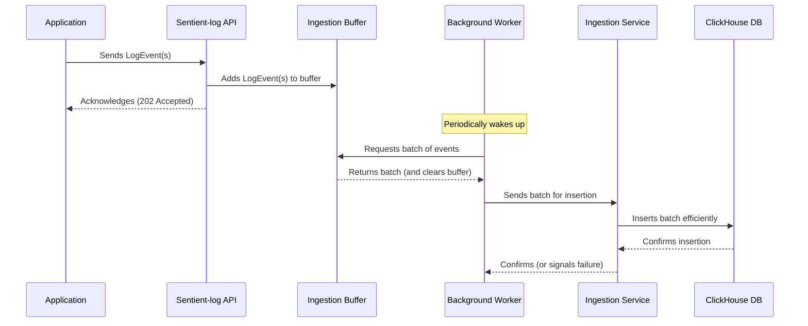

# Chapter 8: Ingestion System

In our last chapter, [ClickHouse Manager](07_clickhouse_manager_.md), we learned how `Sentient-log` expertly connects to the ClickHouse database and runs queries to retrieve the data you need. But how does all that valuable log data *get into* `Sentient-log` in the first place? How do your applications send their events to be stored and analyzed?

That's where the **Ingestion System** comes in! This system is like the highly efficient "data entry clerk" for all your logs. When your applications generate new log events (like a user logging in, an error occurring, or a successful payment), the Ingestion System is responsible for receiving these events, organizing them, and then gently placing them into the ClickHouse database for long-term storage and analysis.

### What Problem Does It Solve?

Imagine your applications are like busy reporters, constantly writing down everything that happens. They generate a lot of notes (log events) very quickly. If they had to wait for someone to carefully file each note individually into a giant library (our ClickHouse database), they would slow down significantly, and the reporting process would grind to a halt.

The core problem the Ingestion System solves is: **How do we receive a very high volume of incoming log data from many applications without slowing those applications down, and then efficiently store that data in the database?**

Let's use a common situation as our main example: **Your web application processes a new user request, generates a log event detailing the request, and needs to send it to `Sentient-log`.**

### Breaking Down the "Data Entry Clerk"

The Ingestion System is designed to handle this high-speed data flow in a few key steps:

1.  **Receiving Logs**: Your applications send their log events to a special entrance in `Sentient-log`.
2.  **Temporary Buffer (The Waiting Room)**: Instead of immediately sending each event to the database, the Ingestion System temporarily collects them in a buffer, like people waiting in a reception area. This makes the initial receiving process super fast for your applications.
3.  **Efficient Batching (Mail Sorting Office)**: Once enough events have accumulated in the buffer, or after a short time, they are grouped into larger "batches." Think of this as gathering many individual letters into a single package. Sending one large package is much more efficient than sending hundreds of individual letters.
4.  **Background Worker (The Delivery Truck)**: A special background worker then takes these batches and, without disturbing the main `Sentient-log` operations, delivers them to the database.
5.  **Database Insertion**: Finally, the batches are inserted into the [ClickHouse Manager](07_clickhouse_manager_.md), which writes them into the ClickHouse database.

### How the Ingestion System Solves Our Use Case

Let's walk through how our web application's log event travels through the Ingestion System.

**Use Case**: Your web application processes a new user request, generates a log event detailing the request, and needs to send it to `Sentient-log`.

1.  **Application sends log event**: Your web application formats its log data as a `LogEvent` (a structured record) and sends it over the network to the `/ingest` endpoint of `Sentient-log`. The application can send many `LogEvent`s at once in an `IngestPayload`.

    ```python
    # Simplified example of an application sending logs
    import httpx
    import asyncio
    from datetime import datetime, timezone

    async def send_log_event():
        log_data = {
            "event_type": "web_request",
            "url": "/api/users/123",
            "latency_ms": 150.7,
            "timestamp": datetime.now(timezone.utc).isoformat(),
            "user_agent": "Mozilla/5.0",
            "metadata": {"user_id": "user-abc", "http_method": "GET"}
        }
        
        payload = {"events": [log_data]} # Can include multiple log_data objects
        
        try:
            async with httpx.AsyncClient() as client:
                response = await client.post("http://localhost:8000/api/v1/ingest", json=payload)
                response.raise_for_status() # Raise an exception for HTTP errors
                print(f"Log event sent successfully! Status: {response.status_code}")
        except httpx.HTTPStatusError as e:
            print(f"Error sending log event: {e}")
        except httpx.RequestError as e:
            print(f"Network error sending log event: {e}")

    # To run this: asyncio.run(send_log_event())
    ```
    Your application sends log data to `Sentient-log` using a simple HTTP POST request. It can send one or many `LogEvent`s in a single `IngestPayload`. `Sentient-log` immediately responds with an "accepted" message (status 202), meaning your application doesn't have to wait for the data to be fully stored.

2.  **Ingestion API receives and buffers**: The `Sentient-log` API receives this `IngestPayload` and quickly adds the events to its internal buffer (`Batcher`). This takes very little time, so your application can continue running without delay.

3.  **Background worker flushes**: In the background, a `FlushWorker` is constantly checking the buffer. Every few seconds, or when the buffer gets full, it takes all accumulated events from the buffer and hands them over to the `IngestionService`.

4.  **Ingestion Service inserts into ClickHouse**: The `IngestionService` receives the batch of events and uses the [ClickHouse Manager](07_clickhouse_manager_.md) to insert them into the `events` table in the ClickHouse database.

This entire sequence ensures that logs are reliably collected and stored without impacting your application's performance.

### Under the Hood: How the Ingestion System Works

Let's look at the components that make up the Ingestion System.



#### 1. The Ingestion API Endpoint (`app/api/ingest.py`)

This is the gateway for all incoming log events. The `ingest_logs` function is designed to be very fast, simply taking the incoming events and adding them to the `batcher`'s buffer.

```python
# From: app/api/ingest.py
from fastapi import APIRouter, BackgroundTasks, Depends
from app.schemas.log import IngestPayload # Defines the structure of incoming events
from app.ingestion.batcher import batcher # Our buffer!
from app.auth.dependencies import verify_ingest_auth # Ensures only authorized apps send logs

router = APIRouter()

@router.post("/ingest", status_code=202, dependencies=[Depends(verify_ingest_auth)])
async def ingest_logs(payload: IngestPayload):
    # This line is key: it adds the received events to the batcher's buffer
    await batcher.add(payload.events) 
    # Immediately return 202 Accepted, so the sender doesn't wait
    return {"status": "accepted"}
```
When your application sends an `IngestPayload` (containing a list of `LogEvent`s), the `ingest_logs` endpoint receives it. Importantly, it uses `await batcher.add(payload.events)` to quickly put the events into a temporary holding area. The `status_code=202` means "Accepted," telling your application, "Got it, I'll handle it," without making it wait for the full storage process. The `verify_ingest_auth` dependency ensures that only authenticated sources can send logs.

The `LogEvent` itself is a simple blueprint for what a log looks like:

```python
# From: app/schemas/log.py (simplified)
from pydantic import BaseModel
from typing import Any, Dict
from datetime import datetime, timezone
import uuid

class LogEvent(BaseModel):
    event_id: uuid.UUID = Field(default_factory=uuid.uuid4)
    timestamp: datetime = Field(default_factory=lambda: datetime.now(timezone.utc))
    event_type: str
    url: str
    latency_ms: float
    user_agent: str
    metadata: Dict[str, Any]
```
This `LogEvent` defines all the key pieces of information we expect for each log entry, like its `timestamp`, `url`, `latency_ms`, and any `metadata`.

#### 2. The Ingestion Buffer (`app/ingestion/batcher.py`)

The `Batcher` is the temporary storage where events wait to be processed. It uses an `asyncio.Lock` to make sure multiple parts of `Sentient-log` (like the API endpoint and the background worker) can safely add or remove events at the same time without data getting mixed up.

```python
# From: app/ingestion/batcher.py
import asyncio
import logging
from app.schemas.log import LogEvent

logger = logging.getLogger(__name__)

class Batcher:
    def __init__(self, batch_size=1000):
        self.batch_size = batch_size
        self.buffer: list[LogEvent] = [] # The actual list holding events
        self._lock = asyncio.Lock() # Ensures safe access

    async def add(self, events: list[LogEvent]):
        async with self._lock: # Lock prevents simultaneous changes
            self.buffer.extend(events) # Add new events to the end

    async def get_batch(self) -> list[LogEvent]:
        """Returns all events currently in the buffer and empties it."""
        async with self._lock:
            if not self.buffer:
                return []
            batch = self.buffer # Take all events
            self.buffer = []    # Empty the buffer
            return batch
            
    async def requeue(self, events: list[LogEvent]):
        """Place events back at the front of the queue on failure."""
        async with self._lock:
            self.buffer = events + self.buffer # Put failed events back at the start

    @property
    def is_full(self) -> bool:
        return len(self.buffer) >= self.batch_size # Is the buffer full?

batcher = Batcher() # Create a single instance of our Batcher
```
The `add` method quickly adds events. `get_batch` is used by the background worker to take all pending events and clear the buffer. If an insertion fails, `requeue` can put events back to be tried again. `is_full` helps the worker decide if it should flush sooner.

#### 3. The Background Worker (`app/ingestion/worker.py`)

This `FlushWorker` is like a persistent delivery truck that runs in the background. It periodically collects batches from the `Batcher` and sends them for insertion into the database.

```python
# From: app/ingestion/worker.py
import asyncio
import logging
from app.ingestion.batcher import batcher
from app.ingestion.service import ingestion_service # Our next stop!

logger = logging.getLogger(__name__)

class FlushWorker:
    def __init__(self, flush_interval=5.0):
        self.flush_interval = flush_interval # How often to check/flush
        self._task = None
        self._is_running = False

    def start(self):
        if self._task is None:
            self._is_running = True
            # Create a background task that runs _loop forever
            self._task = asyncio.create_task(self._loop()) 
            logger.info("Flush worker started")

    async def _loop(self):
        while self._is_running:
            try:
                # Wait for the interval, but flush early if buffer is full
                wait_time = 0.0
                while wait_time < self.flush_interval and self._is_running:
                    if batcher.is_full: # Check if buffer is full
                        break
                    await asyncio.sleep(0.5) # Short sleep, check again
                    wait_time += 0.5

                if self._is_running:
                    await self._flush_now() # Time to flush!
                    
            except asyncio.CancelledError:
                break # Exit gracefully
            except Exception as e:
                logger.error(f"Error in worker loop: {e}", exc_info=True)

    async def _flush_now(self):
        events = await batcher.get_batch() # Get events from the buffer
        if not events:
            return

        success = await ingestion_service.flush_batch(events) # Send to IngestionService

        if not success:
            logger.warning(f"Re-queueing {len(events)} events due to insert failure")
            await batcher.requeue(events) # Put them back if insertion failed

worker = FlushWorker() # Create a single worker instance
```
The `FlushWorker` starts a background task (`_loop`) when `Sentient-log` begins. This loop constantly monitors the `batcher`. If `flush_interval` seconds pass, or if the `batcher` becomes `is_full`, it calls `_flush_now`. `_flush_now` takes a batch from the `batcher` and passes it to the `ingestion_service` for actual database insertion. If the insertion fails, the events are `requeue`d to be tried again later.

The `FlushWorker` is started and stopped during the application's `lifespan` event (similar to how [ClickHouse Manager](07_clickhouse_manager_.md) migrations run), ensuring it's always running when needed:

```python
# From: app/main.py (simplified)
from contextlib import asynccontextmanager
from app.clickhouse.client import run_migrations, close_client
from app.ingestion.worker import worker # Import our worker

@asynccontextmanager
async def lifespan(app: FastAPI):
    # Startup tasks
    await run_migrations()
    worker.start() # Start the ingestion worker here!
    yield # Application runs
    # Shutdown tasks
    await worker.stop() # Stop the worker gracefully
    await close_client()
```
This ensures the `FlushWorker` is actively managing event batches as long as the `Sentient-log` application is running.

#### 4. The Ingestion Service (`app/ingestion/service.py`)

This service is the final step before the database. It takes a batch of `LogEvent`s and formats them correctly for insertion into ClickHouse using the [ClickHouse Manager](07_clickhouse_manager_.md).

```python
# From: app/ingestion/service.py
import logging
import time
from app.schemas.log import LogEvent
from app.clickhouse.client import get_client # Our ClickHouse Manager!

logger = logging.getLogger(__name__)

class IngestionService:
    async def flush_batch(self, events: list[LogEvent]) -> bool:
        """Inserts a batch of events into ClickHouse."""
        if not events:
            return True

        try:
            client = await get_client() # Get a robust ClickHouse client
            data = []
            for e in events:
                data.append([ # Prepare data in a list-of-lists format for ClickHouse
                    e.event_id,
                    e.timestamp,
                    e.event_type,
                    e.url,
                    e.latency_ms,
                    e.user_agent,
                    e.metadata
                ])
                
            await client.insert( # Use ClickHouse client to insert
                'events', # Table name
                data,     # The prepared data
                column_names=['event_id', 'timestamp', 'event_type', 'url', 'latency_ms', 'user_agent', 'metadata']
            )
            
            logger.info(f"Flushed {len(events)} events to ClickHouse")
            return True # Success!
            
        except Exception as e:
            logger.error(f"Failed to flush {len(events)} events to ClickHouse: {str(e)}")
            return False # Failure
            
ingestion_service = IngestionService() # Create a single instance
```
The `flush_batch` method gets the `client` from the [ClickHouse Manager](07_clickhouse_manager_.md). It then converts the list of `LogEvent` objects into a format that the ClickHouse client expects (a list of lists, where each inner list is a row of data). Finally, `await client.insert(...)` sends the entire batch to the ClickHouse database in one efficient operation.

### Conclusion

In this chapter, we've explored the robust **Ingestion System** of `Sentient-log`. You've learned that it acts as the "data entry clerk," efficiently handling the flow of log events from your applications to the ClickHouse database. This is achieved through:
*   A fast API endpoint for receiving events.
*   A `Batcher` for temporary storage and grouping.
*   A `FlushWorker` that operates in the background to deliver batches.
*   An `IngestionService` that formats and inserts data using the [ClickHouse Manager](07_clickhouse_manager_.md).

This system is crucial for enabling your applications to send logs quickly, without performance penalties, while ensuring that all your valuable observability data is reliably stored for later analysis.

You've now completed the `Sentient-log` tutorial! You've gone from authentication, through defining metrics and dimensions, planning queries with AI, building SQL, managing the database, and finally, ingesting data. Congratulations on understanding the core architecture of `Sentient-log`!

---